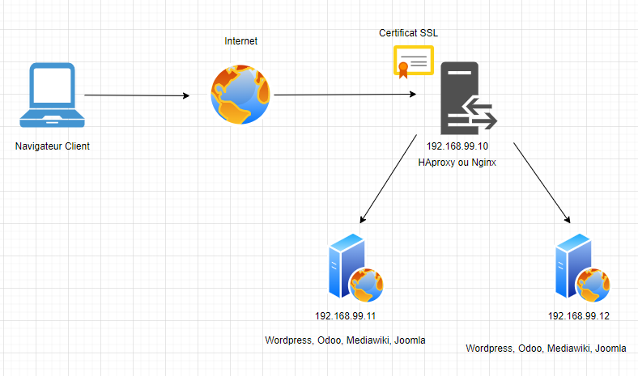

# Projet de DevOps avec Linux, Bash/Python, vagrant, virtualbox
## Objectif général du projet:

Le but de ce projet est de vous familiariser avec l'administration système, l'automatisation, la mise en œuvre de la tolérance de charge et la gestion de la sécurité dans un environnement Linux. Nous allons nous baser sur 4 aplications open source comme exemple, à savoir **Wordpress, Odoo, Mediawiki, et Joomla**. Ce sont toutes des applications 2 tiers, c'est -à-dire qu'elles sont constituée d'une **partie frontale (IHM)** et d'une **partie backend (Base de donnée SQL)**.
Vous serez amené à utiliser **Bash** ou **Python** pour créer des scripts automatisés pour plusieurs tâches. Ce projet vous aidera à acquérir des compétences essentielles pour votre future carrière en DevOps.

## Schéma d'architecture
Voici un schéma d'architecture cible à mettre en place

## Durée du projet: 8 jours.

## Prérequis du projet
- Avoir des bases sur un Linux (CentOs de préférence)
- Avoir des bases en scripting (Shell, Python, ou tout autre langage)
- Savoir utiliser Vagrant et Virtualbox pour rapidement créer des machines virtuelles (c'est un plus)

## Répartition des groupes
Chaque application sera gérée par un groupe de 4 personnes.
- Groupe 1: Wordpress
	- Arouna
	- Choukri
	- Giovani
	- Yousri
	- Amine
	
- Groupe 2: Odoo
	- Abbdelatif
	- Kévin
	- Hadi
	- Yacine
	
- Groupe 3: Mediawiki
	- Jonathan
	- Tigran
	- Yousra
	- Jorge
	
- Groupe 4: Joomla
	- Nasim
	- Christophe
	- Karim
	- Haythem
	
## Tâches spécifiques:

### Jour 1 : Mise en place de l'environnement technique

Installez VirtualBox et Vagrant sur votre système. Créez ensuite un environnement virtuel sur lequel vous travaillerez pour le reste du projet.
Virtualbox est un logiciel de virtualisation de machines virtuelles, et Vagrant est un outil d'**Infrastructure as Code (IaC)**, qui permet de créer rapidement des machines virtuelles dans virtuelle, celà accroit la productivité.

### Jour 2-3 : Installation et configuration automatique de l'application

Développez un script en Bash ou Python qui automatisera l'installation de votre application. Ce script doit inclure la configuration de la base de données nécessaire pour le fonctionnement de l'application. Un plus serait de s'assurer que votre script permette la mise à jour automatique de l'application.

### Jour 4 : Automatisation de la sauvegarde et de la restauration

Développez un script en Bash ou Python pour automatiser les tâches de sauvegarde et de restauration de votre application et de sa base de données. Votre script doit permettre la configuration de la fréquence des sauvegardes.

### Jour 5 : Configuration d'un Load Balancer et d'un Reverse Proxy

Mettez en place un Load Balancer en frontal de la partie IHM de l'application, afin de distribuer la charge entre plusieurs instances de l'application. Configurez également un Reverse Proxy pour améliorer les performances et la sécurité. Beaucoup de solutions existent, on s'attardera uniquement sur deux solutions qui sont généralement utilisées, HAProxy et nginx.
- Les groupes 1 et 2 utiliserons HAProxy
- Les groupes 3 et 4 utiliserons Nginx

### Jour 6 : Configuration d'un certificat autosigné

Configurez un certificat autosigné sur le Load Balancer pour permettre des communications sécurisées. Assurez-vous de comprendre les limitations d'un tel certificat et comment le processus de vérification fonctionne.

### Jour 7-8 : Mise en place d'un stockage LVM pour la base de données

Implémentez une solution de stockage LVM pour stocker les données de la base de données. Votre solution doit permettre l'extension flexible de l'espace de stockage.

## Ressources recommandées:

Documentation officielle de Linux, Bash, Python, Wordpress, le Load Balancer que vous choisissez et LVM.
Forums en ligne, tels que [StackOverflow](https://stackoverflow.com/).
Tutoriels et articles en ligne sur l'automatisation, le load balancing, les certificats autosignés et le stockage LVM.
Voici quelques liens utiles: 
- [Documentation Wordpress](https://wordpress.org/documentation/)
- [Documentation Odoo](https://www.odoo.com/documentation/14.0/administration/install.html)
- [Documentation Mediawiki](https://www.mediawiki.org/wiki/Manual:Installing_MediaWiki)
- [Documentation Joomla](https://docs.joomla.org/J3.x:Installing_Joomla)
- [Documentation de Vagrant](https://developer.hashicorp.com/vagrant/docs)
- [Lien vers quelques stacks vagrant](https://github.com/diranetafen/cursus-devops/tree/master/vagrant)
- [Documentation VirtualBox](https://www.virtualbox.org/wiki/Documentation)
- [Load balancing avec nginx](https://nginx.org/en/docs/http/load_balancing.html)
- [Load balancing avec HAProxy](https://www.digitalocean.com/community/tutorials/how-to-use-haproxy-to-set-up-http-load-balancing-on-an-ubuntu-vps)
- [Documentation  LVM]()
- [StackOverflow](https://stackoverflow.com/)

## Rendus:

A la fin de ce projet, vous devez fournir un repos github de votre projet, contenant:
- Les scripts d'automatisation pour l'installation, la mise à jour, la sauvegarde et la restauration.
- La documentation expliquant comment vos scripts fonctionnent et comment les utiliser. Documentation écrite en Markdown, ce sera une section de votre fichier Readme.md
- Un rapport expliquant comment vous avez mis en place le Load Balancer, le Reverse Proxy, le certificat autosigné et le stockage LVM, y compris les défis que vous avez rencontrés et comment vous les avez surmontés. Ce sera une autre section du fichier Readme.
- Une démonstration du fonctionnement de votre solution, soit par une démonstration en direct, soit par une vidéo enregistrée. Prévoir un Powerpoint pour celà.

### Quelques exemples de rendus de projet
- [jenkins, kubernetes, minikube, terraform, ansible](https://github.com/gengiskahn/projet-fil-rouge-groupe1)
- [gitlab, snyk, docker, gitlab-registry, ansible](https://github.com/abderrezakaddar/fil-rouge)

## Évaluation:

Votre projet sera évalué sur la base de la fonctionnalité et de l'efficacité de vos scripts, de la qualité de votre documentation et de la profondeur de votre compréhension des concepts impliqués.

